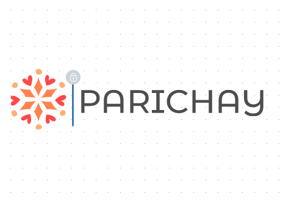

 

  
  <h3 align="center">Parichay</h3>

  

    Embrace Your Identity!
     
    <a href="https://github.com/Joyee2004/Parichay">View Demo</a>
  

<!-- TABLE OF CONTENTS -->

  
Table of Contents

  <ol>
    <li>
      <a href="#about-the-project">About The Project</a>
      <ul>
        <li><a href="#built-with">Built With</a></li>
      </ul>
    </li>
    <li><a href="#usage">Usage</a></li>
    <li><a href="#team">Team</a></li>
  </ol>

<!-- ABOUT THE PROJECT -->
## About The Project

Our project, Parichay, aims to address the challenges faced by the LGBTQ+ community. This comprehensive app endeavors to promote social, economic, and political inclusion, providing solutions to issues such as lack of support, employment difficulties, mental health concerns, housing struggles, and a general lack of awareness about the community.

(<a href="#readme-top">back to top</a>)

### Built With

* Web Application: ReactJs
* Backend: Node.js, Express.js
* Database: MongoDB
* Real-time Communication: Socket.io

(<a href="#readme-top">back to top</a>)

<!-- USAGE EXAMPLES -->
## Usage

1) Help Pages:
* Assist users in finding suitable apartments, jobs, healthcare facilities, and educational opportunities based on their preferences.
* Connect users with healthcare professionals and lawyers, addressing the hesitations and unawareness surrounding these services.

2) Community Chat:
* Provide a platform for open discussions on various issues faced by the community.
* Facilitate connections between like-minded individuals for mutual support.

3) Donations:
* Enable users to contribute to charitable causes supporting the LGBTQ+ community.
* Create a transparent system showcasing the impact of donations.

4) Ask for Help:
* Establish a connection between users and NGOs or advisory bodies for guidance and support.

(<a href="#readme-top">back to top</a>)

## Team

* [Uttara Kamat](https://github.com/idlidosa1206)
* [Sayali Ananda Kadam](https://github.com/say2410)
* [Joyee Biswas](https://github.com/Joyee2004)

(<a href="#readme-top">back to top</a>)

